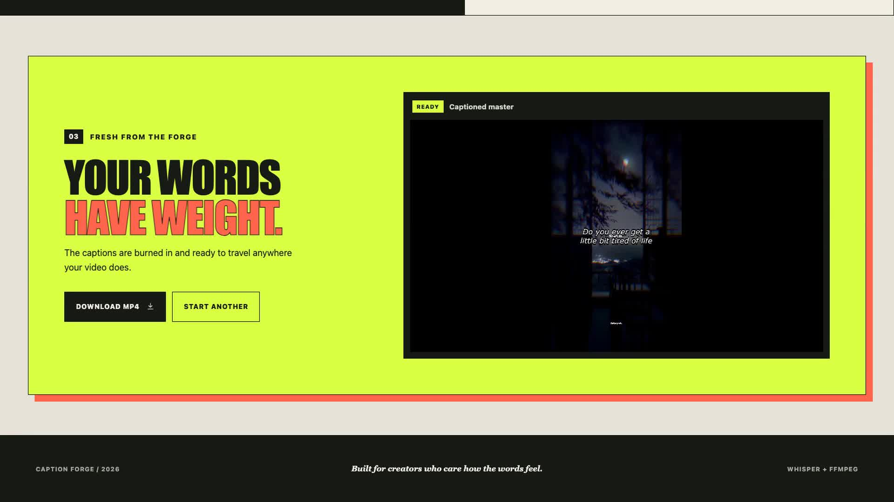

# Caption Forge

Caption Forge is a local-first video captioning studio. Upload an MP4, transcribe its speech with Whisper, customize the subtitle treatment, and download a new video with the captions permanently burned in.

The project pairs a responsive React interface with an Express processing pipeline powered by FFmpeg and `nodejs-whisper`.

## Product demo

[](promo/caption-forge-demo.mp4)

The 32-second walkthrough demonstrates uploading a video, switching caption presets, adjusting typography and position, processing the clip, and previewing the finished export. It includes an original background music track.

## Features

- Drag-and-drop MP4 uploads
- Local video and caption-style preview
- On-device speech transcription with Whisper
- Six subtitle presets:
  - Bold Yellow
  - Minimal White
  - Boxed Caption
  - Karaoke Pink
  - Cinematic
  - Neon Green
- Typeface, size, weight, and screen-position controls
- ASS subtitle generation and FFmpeg subtitle burning
- Render progress interface
- Finished-video playback and MP4 download
- Responsive desktop, tablet, and mobile layouts
- No third-party transcription API

## How it works

```text
MP4 upload
    ↓
Extract a 16 kHz mono WAV track with FFmpeg
    ↓
Transcribe the audio locally with Whisper
    ↓
Generate a styled ASS subtitle file
    ↓
Burn subtitles into the original video with FFmpeg
    ↓
Preview and download the captioned MP4
```

## Tech stack

| Area | Technology |
| --- | --- |
| Frontend | React, Vite, CSS |
| Backend | Node.js, Express |
| Uploads | Multer |
| Transcription | `nodejs-whisper` / Whisper.cpp |
| Video processing | FFmpeg, `fluent-ffmpeg` |
| Subtitle format | Advanced SubStation Alpha (ASS) |

## Prerequisites

Install the following before running the project:

- Node.js 20 or newer
- npm
- FFmpeg available on your system `PATH`

Confirm FFmpeg is installed:

```bash
ffmpeg -version
```

The Whisper `base` model is downloaded automatically the first time transcription runs. The initial render can therefore take longer than later renders.

## Local setup

1. Clone the repository and enter the project:

   ```bash
   git clone <your-repository-url>
   cd caption-forge
   ```

2. Install the backend dependencies:

   ```bash
   npm install
   ```

3. Install the frontend dependencies:

   ```bash
   npm install --prefix frontend
   ```

4. Create a `.env` file in the project root:

   ```env
   PORT=8001
   ```

## Development

Run the Express server in one terminal:

```bash
npm run dev
```

Run the React development server in another terminal:

```bash
npm run client
```

Open [http://localhost:5173](http://localhost:5173). Vite proxies `/api` and `/media` requests to the Express server on port `8001`.

## Production

Build the React application and start Express:

```bash
npm run build
npm start
```

Open [http://localhost:8001](http://localhost:8001). Express serves both the production frontend and processed videos.

## Available scripts

| Command | Purpose |
| --- | --- |
| `npm run dev` | Start the backend with Nodemon |
| `npm run client` | Start the Vite frontend development server |
| `npm run build` | Create the frontend production build |
| `npm start` | Start the production Express server |

## API

### Upload and caption a video

```http
POST /api/jobs
Content-Type: multipart/form-data
```

Form fields:

| Field | Description |
| --- | --- |
| `file` | MP4 video, maximum 10 MB |
| `styleId` | Subtitle preset identifier |
| `fontName` | Font used by the generated subtitles |
| `fontSize` | Subtitle font size |
| `position` | `top`, `center`, or `bottom` |
| `textStyle` | `normal`, `bold`, `italic`, or `bold-italic` |

Successful response:

```json
{
  "status": "success",
  "statusCode": 200,
  "message": "Video processed successfully!",
  "data": {
    "outputFileName": "example_subtitled.mp4",
    "outputUrl": "/media/example_subtitled.mp4"
  },
  "success": true
}
```

### Health check

```http
GET /health
```

## Project structure

```text
caption-forge/
├── frontend/                  # React and Vite interface
│   ├── src/
│   │   ├── App.jsx
│   │   ├── main.jsx
│   │   └── styles.css
│   └── vite.config.js
├── src/
│   ├── config/                # Subtitle presets and style mapping
│   ├── controllers/           # Upload and processing controller
│   ├── middlewares/           # Multer upload validation
│   ├── routes/                # Express API routes
│   ├── services/              # Whisper and FFmpeg integrations
│   └── utils/                 # ASS/SRT and API helpers
├── storage/
│   ├── uploads/               # Original uploaded videos
│   ├── processing/            # Temporary audio and subtitle files
│   └── output/                # Finished captioned videos
├── app.js                     # Express application setup
└── index.js                   # Server entry point
```

## Current limitations

- Only MP4 uploads are accepted.
- Uploads are limited to 10 MB.
- Processing currently happens within the upload request, so long videos keep the request open until rendering finishes.
- Generated and temporary files are stored locally and are not automatically cleaned up.
- Fonts selected in the interface must also be available to FFmpeg on the host machine.

## Privacy

Transcription and video rendering run on the host machine. Uploaded media is not sent to a hosted transcription API. Files remain in the local `storage` directories until manually removed.

## License

This project is licensed under the ISC License.
